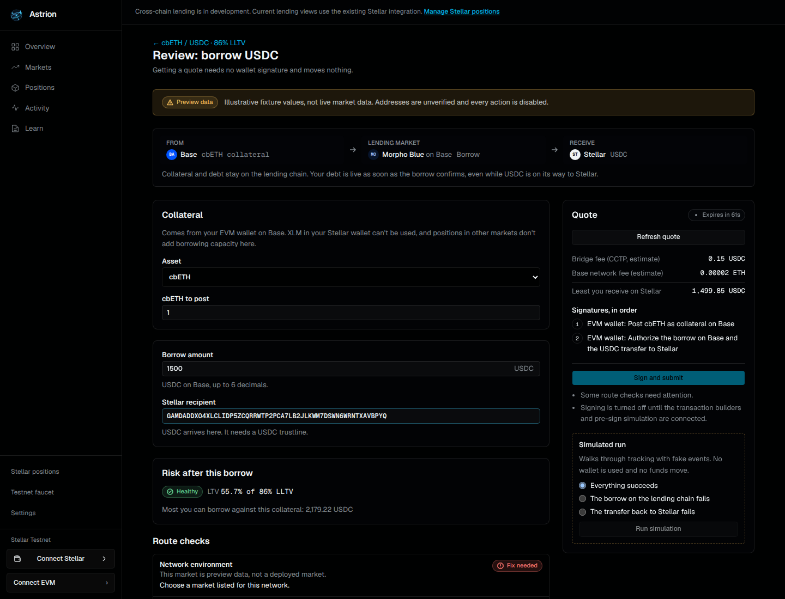

<p align="center">
  
</p>

<h3 align="center">Lend across chains. Bring your liquidity home.</h3>

<p align="center">
  Building access to Base and Ethereum lending markets for Stellar users.
</p>

<p align="center">
  <a href="https://astrion.market">astrion.market</a> ·
  <a href="#getting-started">Get started</a> ·
  <a href="docs/PRODUCT.md">Product scope</a> ·
  <a href="docs/ARCHITECTURE.md">Architecture</a> ·
  <a href="CONTRIBUTING.md">Contribute</a>
</p>

## Direction

Astrion is shifting from its Stellar-native lending implementation toward a
cross-chain lending interface. The planned experience lets Stellar users supply
USDC to markets on Base and Ethereum, borrow against eligible collateral there,
and receive or repay USDC through Stellar.

The first target is **Aave V3 on Base**, followed by **Morpho Blue** and
**Compound III**. Ethereum is the second execution chain. Each
market and action needs its own integration and release checks; naming a protocol
here does not mean it is available in Astrion or imply a partnership.

Native USDC transport is planned through Circle CCTP. The initial cross-chain
alpha will require **both a Stellar wallet and a user-controlled EVM wallet**.
Collateral and debt stay on the lending chain when borrowed USDC returns to
Stellar. Stellar-only control is a later account and messaging integration.

## Current implementation

**No cross-chain transaction can be signed yet.** The interface for the alpha is
built on preview data with every route disabled; contracts, transport, and
position readers come from the contracts repository. See
[docs/ALPHA.md](docs/ALPHA.md) for the full status, route matrix, known
limitations, and an evidence index.

| Area                | Current state                                                                                                    |
| ------------------- | ---------------------------------------------------------------------------------------------------------------- |
| Cross-chain markets | Aave V3, Morpho Blue, and Compound III on Base/Ethereum from a versioned preview fixture; addresses unverified   |
| Wallets             | Stellar Wallets Kit plus EIP-6963 EVM browser wallets, with network checks, account-switch, and lock handling    |
| Review and tracking | Route checks, quotes, signature plans, and per-leg tracking with recovery; signing disabled, runs are simulated  |
| Portfolio           | Per-position risk and partial-data handling on a labeled sample account; live position reads not connected       |
| Soroban lending     | The earlier isolated markets with supply, collateral, borrow, repay, and withdrawal; defaults to Stellar testnet |
| Production status   | No reviewed cross-chain deployment exists                                                                        |



These statements describe source capabilities, not a fresh verification that every
configured testnet contract is currently available. A testnet deployment, a fork
test, a fixture, and a mainnet transaction are different forms of evidence.

See the [capability matrix](docs/PRODUCT.md#capability-matrix) for the planned
routes and the [architecture](docs/ARCHITECTURE.md) for ownership, execution, and
recovery boundaries.

## Planned user journeys

- **Lend from Stellar:** send native USDC to an approved Base/Ethereum market and
  manage the resulting supply position.
- **Borrow to Stellar:** post accepted collateral on the EVM chain, borrow USDC,
  and transfer the proceeds to Stellar. The initial scope uses collateral already
  held on EVM.
- **Repay from Stellar:** transfer USDC to the account holding the debt and repay
  against the protocol's current debt balance.
- **Withdraw to Stellar:** withdraw available USDC from the destination market
  and transfer it home.
- **Start on EVM:** use an EVM position to borrow or withdraw USDC to Stellar.

Supplying USDC does not automatically provide borrowing collateral across these
protocols. Rates, available liquidity, collateral requirements, liquidation, gas,
and bridge costs remain visible parts of the planned experience.

## Getting started

Use Bun `1.4.2`, as specified in `package.json`, and Node.js 22.22 or newer
(required by React Router 8; unit tests also run TypeScript directly with
`node --test`).

```bash
git clone https://github.com/Astrion-Market/interface.git
cd interface
bun install --frozen-lockfile
bun run dev
```

The development server runs at `http://localhost:3000`.

The current lending client defaults to Stellar testnet. Optional overrides live
in `apps/web/.env.local`:

```dotenv
VITE_SOROBAN_RPC_URL=https://soroban-testnet.stellar.org
VITE_SOROBAN_NETWORK_PASSPHRASE="Test SDF Network ; September 2015"
VITE_STELLAR_HORIZON_URL=https://horizon-testnet.stellar.org
```

Contract addresses are currently in
[`astrion-contracts.ts`](apps/web/src/features/lending/lib/astrion-contracts.ts).
Changing endpoints alone does not provide a valid deployment for another network.
Keep environment, network passphrase, contracts, and token identities consistent.
Client-side `VITE_` configuration is public; it must not contain signing secrets.

No extra configuration is needed for the cross-chain screens: they read the
preview fixture. Add `?sample=true` to `/portfolio` or `/dashboard` for the sample
account, and use "Run simulation" on a review screen to exercise tracking.

| Command                           | Purpose                                          |
| --------------------------------- | ------------------------------------------------ |
| `bun run dev`                     | Start development through Turborepo              |
| `bun run build`                   | Build workspace packages                         |
| `bun run lint`                    | Run ESLint                                       |
| `bun run typecheck`               | Check TypeScript types                           |
| `bun run test`                    | Unit tests (`node --test`)                       |
| `bun run --cwd apps/web test:e2e` | Mocked browser journeys and accessibility checks |
| `bun run format`                  | Format files covered by workspace format scripts |

Always use `bun run <script>`: `bun build` and `bun test` are Bun's own bundler
and test runner, not these scripts.

## Repository structure

```text
apps/web/src/
  features/crosschain/  # Cross-chain model, fixture client, checks, tracking, views
  features/lending/     # Existing Soroban readers, mutations, and lending screens
  features/wallet/      # Stellar wallet integration and EVM sessions (evm/)
  routes/            # Route modules (table in src/routes.ts)
  root.tsx           # Document shell, providers, error boundary
  styles/            # App styles
  ui/                # Shared app UI and landing sections
apps/web/e2e/        # Playwright journeys with a mocked EVM wallet
packages/ui/         # Shared components and design tokens
docs/
  PRODUCT.md         # Scope, capability matrix, and rollout criteria
  ARCHITECTURE.md    # Current integration and proposed cross-chain boundaries
  ALPHA.md           # Alpha status, route matrix, limitations, evidence index
```

The stack is React 19, React Router 8 (framework mode with server rendering),
Vite 8, TanStack Query, Tailwind CSS 4, TypeScript 6, Stellar SDK 17, and Stellar
Wallets Kit, managed with Bun and Turborepo. `bun run build` produces
`apps/web/build/`; serve it with `bun run --cwd apps/web start`.

## Roadmap and contributions

The interface for the alpha is in place on preview data. The next work connects it
to real infrastructure: verified deployment manifests, transaction builders with
pre-sign simulation, execution accounts, the tracking service, and live market and
position reads. [docs/ALPHA.md](docs/ALPHA.md#work-packages) lists scoped work
packages.

See [delivery stages](docs/PRODUCT.md#delivery-stages) and
[CONTRIBUTING.md](CONTRIBUTING.md) to scope a contribution. The related
[contracts repository](https://github.com/Astrion-Market/contracts) owns contract
implementation; its milestones must be reconciled before enabling cross-chain
writes in this interface.

## License

```
MIT License. Copyright (c) 2026 Astrion Labs

Permission is hereby granted, free of charge, to any person obtaining a copy
of this software and associated documentation files (the "Software"), to deal
in the Software without restriction, including without limitation the rights
to use, copy, modify, merge, publish, distribute, sublicense, and/or sell
copies of the Software, and to permit persons to whom the Software is
furnished to do so, subject to the following conditions:

The above copyright notice and this permission notice shall be included in all
copies or substantial portions of the Software.

THE SOFTWARE IS PROVIDED "AS IS", WITHOUT WARRANTY OF ANY KIND, EXPRESS OR
IMPLIED, INCLUDING BUT NOT LIMITED TO THE WARRANTIES OF MERCHANTABILITY,
FITNESS FOR A PARTICULAR PURPOSE AND NONINFRINGEMENT. IN NO EVENT SHALL THE
AUTHORS OR COPYRIGHT HOLDERS BE LIABLE FOR ANY CLAIM, DAMAGES OR OTHER
LIABILITY, WHETHER IN AN ACTION OF CONTRACT, TORT OR OTHERWISE, ARISING FROM,
OUT OF OR IN CONNECTION WITH THE SOFTWARE OR THE USE OR OTHER DEALINGS IN THE
SOFTWARE.
```
