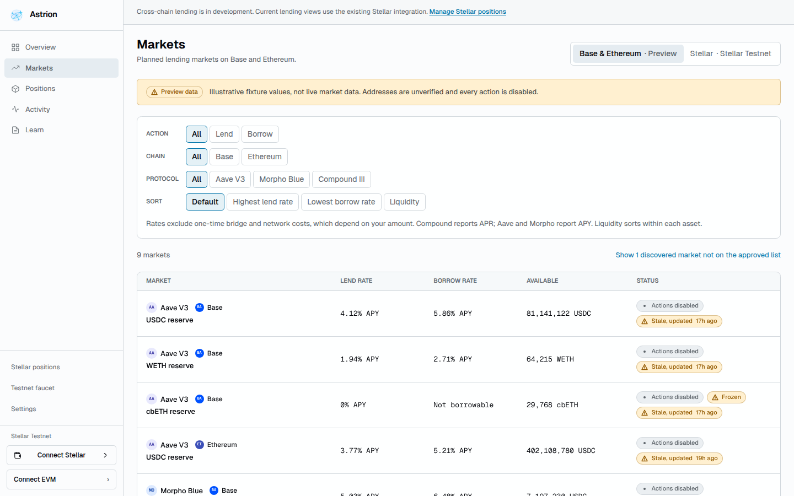
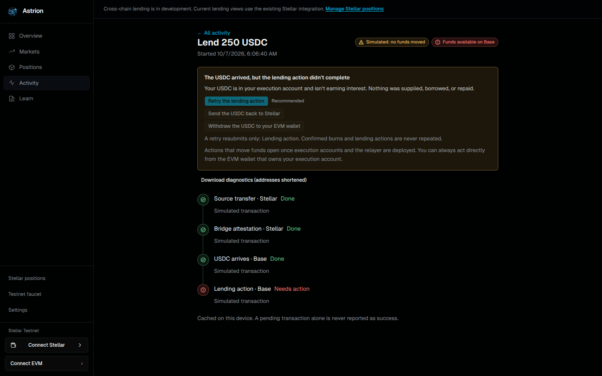

# Cross-chain alpha: status and evidence

Status as of 2026-10-07. This page separates what the interface does today from
what still depends on the contracts repository. Nothing here describes a live
cross-chain route: every route is disabled and every market value is preview data.

## What works in the interface

| Area                | What you can do now                                                                                               | Data                                  |
| ------------------- | ----------------------------------------------------------------------------------------------------------------- | ------------------------------------- |
| Markets             | Browse Aave V3, Morpho Blue, and Compound III markets on Base and Ethereum; filter and sort                       | Preview fixture, unverified addresses |
| Market detail       | Rates with APY/APR basis, liquidity, caps, collateral rules, per-action availability with reasons                 | Preview fixture                       |
| Wallets             | Connect a Stellar wallet and an EVM wallet (EIP-6963 browser wallets); see each wallet's role                     | Live wallet state                     |
| Route checks        | Network, native USDC, trustline, balances, chain, execution account, gas                                          | Live Stellar/EVM reads where possible |
| Review              | Exact amounts, quote with fees and expiry, ordered signature plan; signing stays disabled                         | Preview fees                          |
| Lend / borrow       | Full review flows, borrow risk preview, collateral checks                                                         | Preview fixture                       |
| Repay / withdraw    | Partial or full repay with transit buffer, direct EVM repay steps, withdraw limits, collateral withdrawal preview | Sample account                        |
| Activity            | Per-leg tracking, recovery guidance, diagnostics export                                                           | Simulated runs only                   |
| Portfolio, overview | Positions by chain and protocol, per-position risk, partial-data handling                                         | Labeled sample account                |
| Existing Stellar    | The earlier Soroban lending markets and positions (`/legacy`, `?venue=stellar`)                                   | Stellar testnet                       |

## Route matrix

| Protocol     | Base                          | Ethereum             |
| ------------ | ----------------------------- | -------------------- |
| Aave V3      | First planned route; disabled | After Base; disabled |
| Morpho Blue  | After first route; disabled   | After Base; disabled |
| Compound III | After first route; disabled   | After Base; disabled |

Each route opens only after its contracts, testnet transport, fork tests, and
release checks pass. The in-app route panel on `/markets` shows the same reasons.

## Known limitations

- No cross-chain transaction can be signed. Builders, pre-sign simulation, and
  execution accounts (C08–C10, C16) don't exist yet.
- Market data, prices, and fees are an interface-draft fixture
  (`apps/web/src/features/crosschain/fixtures/markets.preview.json`), not live
  reads. Addresses are unverified until C05 manifests exist.
- Position reads aren't connected; portfolio views use a labeled sample account.
- Activity is cached on the device. The tracking service (C17) isn't built, so
  only simulated runs appear.
- EVM wallets connect through browser extensions only; WalletConnect isn't wired.
- Stellar-only signing is a separate future project.

## App routes

| Route                                 | Purpose                                                    |
| ------------------------------------- | ---------------------------------------------------------- |
| `/`                                   | Landing page                                               |
| `/dashboard`                          | Overview (`?sample=true` for the sample account)           |
| `/markets`                            | Cross-chain markets (`?venue=stellar` for Soroban markets) |
| `/markets/$chain/$protocol/$marketId` | Market detail                                              |
| `/review?market=…&action=…`           | Transaction review                                         |
| `/activity`, `/activity/$operationId` | Tracking and recovery                                      |
| `/portfolio`                          | Positions (`?sample=true`, `?venue=stellar`)               |
| `/docs`                               | Help: debt location, transit risk, rates, bridge, recovery |
| `/settings`                           | Wallets and theme                                          |
| `/design-system`                      | Component gallery for design review (unlinked)             |
| `/legacy`                             | Existing Stellar positions                                 |

## Evidence index

Each claim above traces to source and tests. Mocked browser tests are not protocol
fork tests, and neither is testnet bridge evidence.

| Claim                                                    | Source                                              | Tests                                     |
| -------------------------------------------------------- | --------------------------------------------------- | ----------------------------------------- |
| Amounts never pass through floating point                | `features/lending/lib/amounts.ts`                   | `amounts.test.ts`                         |
| Fixture drift fails loudly                               | `features/crosschain/fixture-client.ts`             | `crosschain.test.ts`                      |
| Disabled actions always carry reasons                    | `features/crosschain/model.ts`                      | `crosschain.test.ts`, `e2e/journeys`      |
| Test tokens can't reach mainnet; USDbC isn't native USDC | `features/crosschain/preflight.ts`                  | `preflight.test.ts`                       |
| Quotes invalidate on change, expire, and cap fees        | `features/crosschain/quote.ts`                      | `operations.test.ts`, `e2e/journeys`      |
| Tracking ignores duplicates and never regresses          | `features/crosschain/operations.ts`                 | `operations.test.ts`                      |
| Risk is per position; unknown is never healthy           | `features/crosschain/risk.ts`, `portfolio-model.ts` | `risk.test.ts`, `portfolio-model.test.ts` |
| Full repay is confirmed only at zero debt                | `features/crosschain/settlement.ts`                 | `settlement.test.ts`                      |
| Retries never repeat a confirmed burn or action          | `features/crosschain/recovery.ts`                   | `recovery.test.ts`                        |
| Wallet sessions handle decline, switch, lock, restore    | `features/wallet/evm/evm-session.ts`                | `evm-session.test.ts`, `e2e/journeys`     |
| Pages pass WCAG 2 A/AA automated checks in both themes   | All app routes                                      | `e2e/accessibility.spec.ts`               |
| Contract behavior and bridge transfers                   | Contracts repository                                | C18–C20 evidence (pending)                |

## Work packages

| Package                 | Good for                     | Finish line                                                                                            |
| ----------------------- | ---------------------------- | ------------------------------------------------------------------------------------------------------ |
| Live market readers     | Frontend + DeFi contributor  | Replace the fixture source in `use-crosschain-markets.ts` with C16 reads; keep the parser's guarantees |
| Position readers        | Frontend + DeFi contributor  | Feed `buildPortfolioView` from protocol reads with reconciliation                                      |
| WalletConnect           | Wallet engineer              | Mobile EVM wallets through the same `evm-session` reducer                                              |
| Transaction builders    | Transaction UX + contracts   | Enable signing behind simulation once C09/C16 land                                                     |
| Tracking service client | Frontend/backend integration | Swap the device cache in `operations-store.tsx` for C17                                                |
| Help and onboarding     | Technical writer/design      | User-tested copy for `/docs` and recovery guides                                                       |

