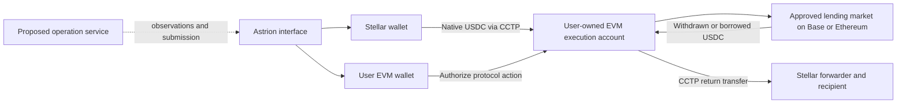

# Interface architecture and cross-chain boundaries

Status: current implementation inventory plus proposed cross-chain design,
2026-10-07. This document defines interface responsibilities; it does not claim
that destination accounts, bridges, protocol adapters, or backend services have
been implemented. See [product scope](PRODUCT.md) for route availability.

## Current integration

The application uses React, TanStack Router/Query, and the shared `packages/ui`
components. Lending reads simulate Soroban calls; writes prepare, simulate, sign,
submit, and poll Stellar transactions. Wallet signing uses Stellar Wallets Kit.

| Responsibility                             | Existing source                                                                                                 |
| ------------------------------------------ | --------------------------------------------------------------------------------------------------------------- |
| Wallet connection and Stellar signing      | [stellar-wallet.ts](../apps/web/src/features/wallet/stellar-wallet.ts)                                          |
| Wallet state and restoration               | [wallet-provider.tsx](../apps/web/src/features/wallet/wallet-provider.tsx)                                      |
| Network, contracts, and custom test assets | [astrion-contracts.ts](../apps/web/src/features/lending/lib/astrion-contracts.ts)                               |
| Soroban read/write transport               | [soroban.ts](../apps/web/src/features/lending/lib/soroban.ts)                                                   |
| Isolated-market reads                      | [isolated-market.ts](../apps/web/src/features/lending/lib/isolated-market.ts)                                   |
| Portfolio aggregation                      | [portfolio-contracts.ts](../apps/web/src/features/lending/lib/portfolio-contracts.ts)                           |
| Mutations and invalidation                 | [use-lending-write-mutation.ts](../apps/web/src/features/lending/hooks/mutations/use-lending-write-mutation.ts) |
| Current query identities                   | [query-keys.ts](../apps/web/src/features/lending/hooks/queries/query-keys.ts)                                   |

The configured addresses and custom tokens belong to the earlier Stellar
testnet-oriented integration. They must not be repurposed as canonical USDC or
cross-chain deployment records. Existing read-error filtering and query keys need
explicit partial-data and network scoping work during the model migration.

## Proposed execution model



This is a target flow, not the current application. An execution account is
scoped by owner, chain, protocol, market scope, and version. It owns the protocol
supply claims, collateral, and debt. Separate scopes avoid unintentionally
sharing collateral or debt between users and strategies. The exact account/module
design must be reviewed in the contracts repository before the interface depends
on it.

The connected Stellar wallet authorizes Stellar operations. The EVM owner
authorizes EVM actions. Displaying both addresses in the UI establishes neither
cross-chain authority nor custody. A relayer submits permitted transactions and
reports observations; it must not have authority to redirect funds, replace an
intent, or spend without the owner's authorization.

The target design includes direct owner access when the UI or relayer is
unavailable. Pausing new risk must preserve protocol-valid repayment and exit
paths. An aggregate portfolio is a display projection, not a shared collateral
pool or a transferable debt representation.

## Transport versus authorization

CCTP is the selected native-USDC transport direction. A transfer receipt does not
authorize an arbitrary borrow or withdrawal. Account signatures, action scope,
recipient binding, deadlines, and replay protection remain separate requirements.

Inbound Stellar delivery uses Circle's documented `CctpForwarder` parameters and
recipient hook encoding. Stellar USDC precision differs from CCTP message units;
reviewed builders must handle conversion and dust. Validate recipients and token
identity before signing. The on-chain forwarder is distinct from a hosted
submission service. [Circle Stellar reference](https://developers.circle.com/cctp/references/stellar),
[Circle capabilities](https://developers.circle.com/cctp/concepts/supported-chains-and-domains).

Axelar GMP is a candidate for a later Stellar-only authorization flow. Stellar
documents cross-chain messaging, but Astrion still needs authenticated source
contracts, owner mapping, account recovery, and replay/order handling before such
commands can control an EVM position. [Stellar cross-chain tooling](https://developers.stellar.org/docs/tools/infra-tools/cross-chain).

## Proposed interface boundaries

| Layer                          | Responsibility                                                                                    | Must not assume                                                |
| ------------------------------ | ------------------------------------------------------------------------------------------------- | -------------------------------------------------------------- |
| Deployment/capability registry | Environment, chain, canonical token, protocol version, market, allowed actions, verification time | A symbol or chain logo proves route support                    |
| Wallet sessions                | Addresses, selected networks, signer readiness, disconnect/reconnect                              | A Stellar wallet can sign EVM actions                          |
| Protocol readers               | Positions, native risk measures, rates, caps, liquidity, source block/ledger                      | All lending protocols share a collateral or rate model         |
| Quote and transaction builders | Integer amounts, intended account, recipient, fees, deadline, simulation, expected steps          | A quote guarantees destination execution                       |
| Operation service client       | Intent IDs, receipts, status reconciliation, resumable user actions                               | Backend status is proof of custody, solvency, or finality      |
| Presentation                   | Route review, per-position risk, pending/error/recovery states                                    | Unknown debt equals zero or bridging funds are already earning |

Reuse existing components and Stellar transport where applicable. Introduce
chain/protocol-aware models and isolate legacy readers before connecting new
writes. Shared schemas and builders should come from versioned contracts/SDK
artifacts; an interface fixture must declare its schema version and demo status.
The locations above are responsibilities, not modules already present in source.

### Identity and amount rules

- Distinguish network environment, EVM chain ID, CCTP domain, and Stellar network
  passphrase. Do not key all accounts under a single generic wallet address.
- Identify a market by chain, protocol/version, and its canonical address or
  market ID; token symbols alone are insufficient.
- Scope queries and persisted operations to network, account owner, execution
  account, protocol, and market. Switching wallets must not reuse another
  account's debt or pending-action controls.
- Carry token quantities as exact integers with explicit decimals. Format only
  at the display boundary; never derive signed amounts from floating-point USD
  summaries. Preserve canonical token identity even where symbols match.
- Keep supplied assets, collateral, debt, in-flight funds, and wallet balances
  separate. Use timestamps and completeness markers on aggregate valuations.

## Operation lifecycle and recovery

A planned transfer-funded action has separate observable steps:

```text
draft → source submitted → source confirmed → attestation pending
      → destination minted → protocol action pending → completed
```

Borrowing to Stellar starts with collateral/borrow execution and then its return
transfer. Withdrawal likewise precedes a separate return transfer. Do not force
every journey into one linear transaction record: each leg needs its own hash,
message/intent identifier, status, finality, and retry rule.

| Situation                                        | Interface behavior                                                                    |
| ------------------------------------------------ | ------------------------------------------------------------------------------------- |
| Source transaction submitted                     | Show pending; do not infer minted funds or a position                                 |
| Attestation delayed                              | Preserve identifiers and show delivery pending; no duplicate burn                     |
| Destination minted, lending action failed        | Show owner-controlled funds on the destination and valid retry/recovery choices       |
| Borrow succeeded, payout delayed                 | Show live debt and liquidation exposure alongside pending delivery                    |
| Repayment delivered after debt accrued           | Refresh debt; show residual debt or an explicit top-up requirement                    |
| Execution intent expired after burn              | Recover/complete delivery separately; request fresh action authorization where needed |
| Relayer offline or wallet disconnected           | Restore confirmed progress; provide reviewed self-submit or direct-owner paths        |
| Data incomplete or chain reorganization detected | Mark uncertainty and reconcile receipts before reporting completion                   |

A source burn cannot be cancelled by dismissing a dialog or reaching an app
timeout. Mint replay protection and protocol-action replay protection are
different: already minted funds may still need a lending action. A retry must not
repeat a confirmed borrow or source transfer. Prefer recoverable destination
funding followed by bounded execution over implying cross-chain atomicity.

## Integration and release gates

Interface-only development can establish product decisions, navigation, visual
components, scoped models, and explicitly labeled fixtures. It cannot establish
live contract capability. Before a money-moving route is enabled, require:

1. Verified environment-specific protocol, market, token, and transport manifests.
2. Implemented owner authorization and direct recovery, reconciled with this
   proposed account design in the contracts repository.
3. Versioned builders/schemas, simulation, actual signer checks, and amount and
   recipient validation.
4. Separate evidence for canonical-USDC transport, protocol behavior, and the
   composed journey, including restart, delay, and failure recovery.
5. For mainnet, independent review, operating ownership, limits, monitoring, and
   an explicit route release decision.

No schema, manifest, relayer API, or execution-account deployment is delivered by
this documentation increment. The contracts architecture milestone remains
pending; interface-first sequencing records the proposal here for later
reconciliation. Future contributors should update both this inventory and the
[product matrix](PRODUCT.md#capability-matrix) when capabilities actually ship.
